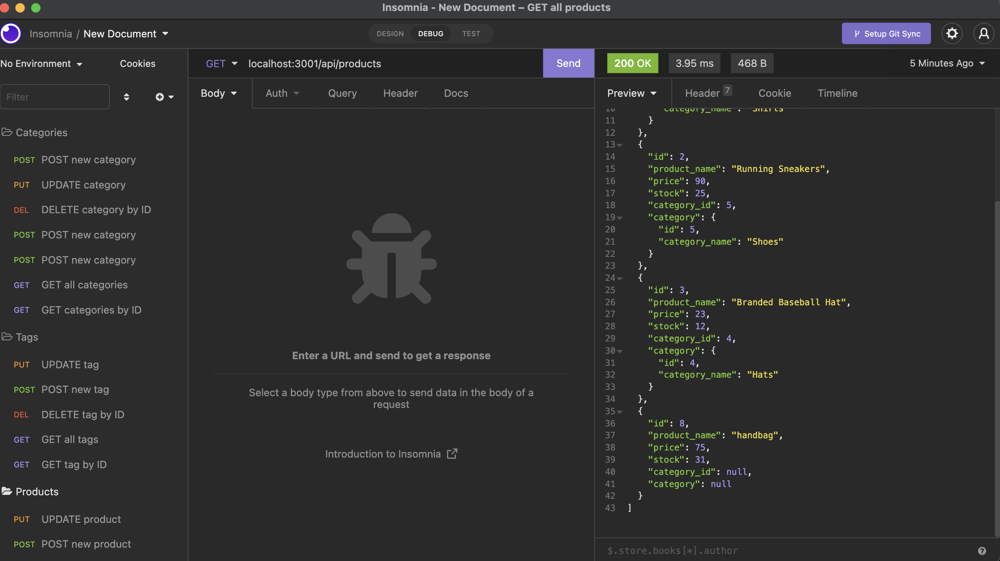

# Ecom-Back_end

For this challenge, I was able to use Insomnia rest API to create routes to see data in my database. I was able to connect to my DBeaver, seed to data with VS Code, and then route the API's to see them in Insomnia. This challenge was a refactoring challenge; so while we had code to start, this was still a challenge to get up and running. Down below is a screenshot of my final product and also the google drive link to view the live demo.

## Here is the ask for the challenge:
- AS A manager at an internet retail company
- I WANT a back end for my e-commerce website that uses the latest technologies
- SO THAT my company can compete with other e-commerce companies

## Here is the criteria to follow for the challenge:
- GIVEN a functional Express.js API
- WHEN I add my database name, MySQL username, and MySQL password to an environment variable file
- THEN I am able to connect to a database using Sequelize
- WHEN I enter schema and seed commands
- THEN a development database is created and is seeded with test data
- WHEN I enter the command to invoke the application
- THEN my server is started and the Sequelize models are synced to the MySQL database
- WHEN I open API GET routes in Insomnia for categories, products, or tags
- THEN the data for each of these routes is displayed in a formatted JSON
- WHEN I test API POST, PUT, and DELETE routes in Insomnia
- THEN I am able to successfully create, update, and delete data in my database

[Live Link](https://drive.google.com/file/d/1fRNzF_H0zsRO-Ddqw-XpPLH3gZCuzZAI/view)
Click this link to see the google drive video

Here is what the final product looks like:
